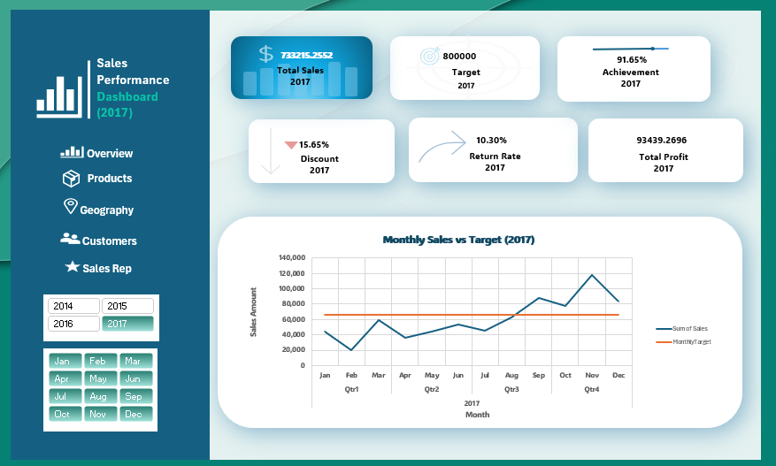

Sales Performance Dashboard (2017)

Interactive Excel dashboard for a Sales Director to track KPIs, product profitability, customer value, and sales rep performance. 
Built with Power Pivot, DAX, and Power Query.

Tools Used:
- Excel (Power Pivot, Power Query, DAX)
- Pivot Tables and Charts
- Slicers and Navigation Buttons

 Data Preparation and Modeling:
- Cleaned data using Power Query: standardized dates, split State-City column, removed nulls
- Created relationships between Orders, Returns, People, and Ship Cost tables in Power Pivot
- Built DAX measures for KPIs: Total Sales, Total Profit, Return Rate, Achievement Percentage, Discount Percentage

Dashboard Pages:

| Page      | Content |
|-----------|---------|
| Overview  | KPIs and Sales vs Target line chart |
| Products  | Profit, discounts, and returns by category and sub-category |
| Geography | Top 10 states and top 10 cities by sales |
| Customers | Top and bottom customers by profit, discounts, and segments |
| Sales Rep | Performance vs target, profit, discounts, and returns |

Key Insights:
1. Global Financial Performance
- Total revenue reached $733,215, missing the annual target by $66,800 (91.7% achievement)
- Net profit stood at $93,439 with a 12.74% profit margin, dragged down by hidden losses in specific categories and states

2. Product Category Performance
- Copiers were the highest profit driver at $25,031, maintaining a 39.8% profit margin with low discounts averaging 15%
- Tables generated nearly $60,000 in sales but caused a net loss of $8,140
- Root cause: aggressive discounts on Tables (26.5%) and Machines (30%) to close deals quickly

3. Sales Representative Efficiency
- Kelly Williams generated $24,000 more in gross sales than Cassandra Brandow, but Cassandra delivered $1,300 more in net profit
- Root cause: Kelly used heavy discounts (23.9%) to drive volume, while Cassandra maintained pricing discipline
- Key risk: 82.4% of total net profit relies on only two reps (Anna Andreadi and Chuck Magee), creating high dependency risk

4. Product Returns
- Total returns cost the business $75,502 during the fiscal year
- Anna Andreadi led in profit but her region suffered a 20.8% return rate (one of every five dollars sold was returned)
- The West region alone accounted for 69% of all corporate returns ($52,100)

Strategic Recommendations:

1. Enforce a 15% maximum discount cap on Tables and Machines and in high-loss states like Texas
2. Change sales incentives to reward net profit margin contribution instead of gross sales volume
3. Investigate West region returns through a cross-departmental review between Sales and Logistics
4. Focus marketing and sales efforts on the Consumer segment, which generated 49% of total net profit ($45,500)

Preview

Author:
ASMA SAAD 
